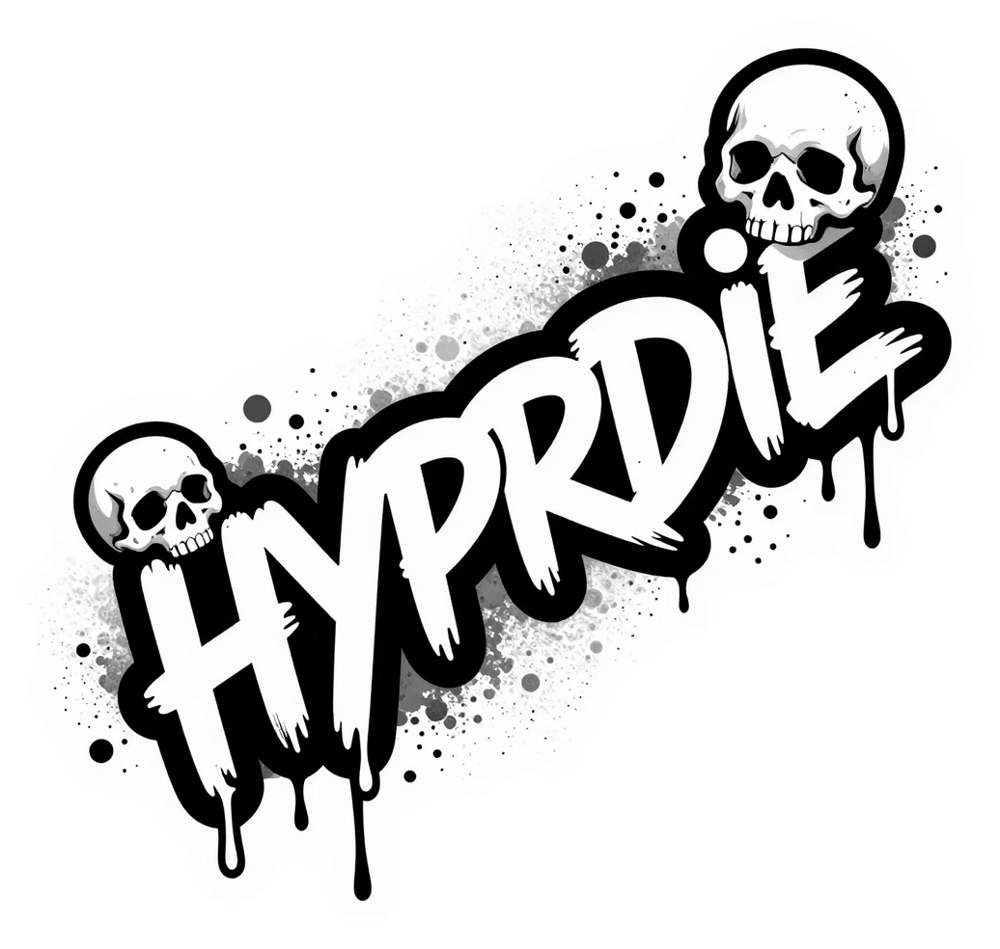

# hyprdie

<p align="center">
  <picture>
    <source media="(prefers-color-scheme: light)" srcset="assets/wordmark-transparent.png">
    <source media="(prefers-color-scheme: dark)"  srcset="assets/wordmark-transparent-inverted.png">
    
  </picture>
</p>

**A graceful shutdown screen for Hyprland.**

hyprdie puts up a fullscreen overlay listing everything still running in your
session, asks each app to close, escalates when one refuses to, and only then
exits the session. So a reboot stops silently eating unsaved work.

<p align="center">
  
</p>

## Requirements

- **Hyprland.** hyprdie checks `HYPRLAND_INSTANCE_SIGNATURE` at startup and exits
  with a clear message if it isn't set.
- **systemd**, for the session cgroup. There's a fallback that walks the process
  tree when no cgroup is available.
- No toolkit dependencies. The overlay is drawn directly through `wl_shm` ARGB
  and `smithay-client-toolkit` — no GTK, no winit.

## Build

```sh
cargo build --release
# target/release/hyprdie
```

## Usage

```sh
hyprdie                                   # close everything, then exit Hyprland
hyprdie --post-cmd 'systemctl poweroff'   # ... and power off afterwards
hyprdie --post-cmd 'systemctl reboot'
hyprdie --dry-run                         # show the overlay, close nothing
hyprdie --config /path/to/config.toml     # use a specific config file
```

`--dry-run` is the safe way to see what it does before you bind it to a key.

### Hyprland keybind

```conf
# ~/.config/hypr/hyprland.conf
bind = $mainMod SHIFT, E, exec, hyprdie --post-cmd 'systemctl poweroff'
```

Any chord works — that one is only an example. For a plain logout, leave
`--post-cmd` off and hyprdie will close everything and exit by itself.

**Why `--post-cmd` rather than `&&`:** the post command runs *before* Hyprland
exits. Commands like `systemctl reboot` need the session to still be active when
they ask logind/polkit for authorisation, and session teardown races them if you
exit first. Chaining them in a shell loses that ordering.

## Keys

| Key | Action |
| --- | --- |
| `Esc` | Cancel. Closes nothing, leaves the session running. |
| `F` | Force. `SIGKILL`s every tracked process at once. |

Note that `F` is not "force the shutdown": it skips both `commands.post` and the
`hyprctl dispatch exit`, so you're left in an empty session. It's an escape hatch
for a wedged app, not a faster poweroff.

## How it works

1. Collects the session's processes, preferring the **systemd session cgroup** over
   a process-tree walk — the walk can miss apps that have been reparented.
2. Picks up **layer surfaces** (bars, notification daemons) via `hyprctl -j layers`
   so they don't outlive the session.
3. Asks each window to close with `hyprctl dispatch closewindow`, and sends
   `SIGTERM` to each process.
4. Retries every `behavior.retry_interval_ms`.
5. Anything still alive after `behavior.sigkill_timeout_ms` is escalated to `SIGKILL`.
6. Once nothing is left, runs `commands.post` and then `hyprctl dispatch exit`.

Closing the terminal that launched hyprdie won't kill it: it ignores `SIGHUP` so
it survives long enough to reach step 6.

## Configuration

`~/.config/hyprdie/config.toml` — or `$XDG_CONFIG_HOME/hyprdie/config.toml`.
`--config` overrides both. Every key is optional; see
[`config.example.toml`](config.example.toml).

### `[ui]`

| Key | Default | Meaning |
| --- | --- | --- |
| `title` | `"Ending session..."` | Heading text |
| `background` | *(none)* | Background image; `~` is expanded. The format is sniffed from the file content, not the extension |

[`assets/background.png`](assets/background.png) is a 1920×1080 example that
cover-scales cleanly.

### `[ui.colors]`

| Key | Default | |
| --- | --- | --- |
| `title` | `#ffffff` | |
| `heading` | `#ffffff` | |
| `app` | `#acb5c7` | The `class — title` list |
| `hint` | `#808080` | |
| `background` | `#1b1818` | Solid colour, used when no background image is set |

### `[behavior]`

| Key | Default | Meaning |
| --- | --- | --- |
| `poll_interval_ms` | `150` | How often the remaining-app list refreshes |
| `retry_interval_ms` | `5000` | How often close attempts are retried |
| `sigkill_timeout_ms` | `10000` | Wait before escalating `SIGTERM` to `SIGKILL` |
| `dry_run` | `false` | Same as `--dry-run` |
| `no_exit` | `false` | Close everything, but don't leave Hyprland |

### `[commands]`

| Key | Default | Meaning |
| --- | --- | --- |
| `post` | *(none)* | Run before the session exits. `--post-cmd` overrides it. |

## Assets

The images the project uses live in [`assets/`](assets/):

| File | Used for |
| --- | --- |
| `icon.svg`, `icon-{16..512}.png` | App icon |
| `background.png` | Default overlay background |
| `wordmark-transparent.png` | README and web — light theme |
| `wordmark-transparent-inverted.png` | README and web — dark theme |
| `hero.png` | The README image above |

None of this is wired into the build yet — nothing is embedded in the binary and
there's no install step, so the icon and background are not picked up
automatically.

[`logos/`](logos/) is the design record behind them: the candidates, the
generation pipeline, and the size studies, browsable at
[`logos/index.html`](logos/index.html).

## Status

Early. `0.1.0`, build-from-source only — no `.desktop` file, no install script,
no packaging. [`TODO.md`](TODO.md) tracks what's next.

## Licence

Not chosen yet. There is no `LICENSE` file in the repository.
