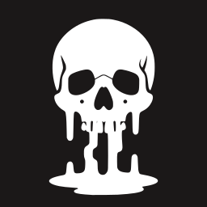
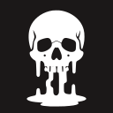
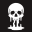

# hyprdie — brand assets

<p align="center">
  <picture>
    <source media="(prefers-color-scheme: light)" srcset="../assets/wordmark-transparent.png">
    <source media="(prefers-color-scheme: dark)"  srcset="../assets/wordmark-transparent-inverted.png">
    
  </picture>
</p>

The images the project ships live in [`../assets/`](../assets). This folder is the
design record behind them — where each came from, what was rejected, and why.
Nothing here is needed to build or install hyprdie, and there is a browsable
version of the same thing at [`index.html`](index.html).

## What shipped

| Asset | File | Used for |
| --- | --- | --- |
| App icon | `assets/icon.svg`, `assets/icon-{16,24,32,48,64,128,256,512}.png` | `.desktop` icon, Waybar |
| Hero | `assets/hero.png` | README banner |
| Background | `assets/background.png` | Default overlay background |
| Wordmark | `assets/wordmark-transparent.png` (light) · `assets/wordmark-transparent-inverted.png` (dark) | README and web |

The two wordmarks are the same artwork with the colours inverted, so each one's
plate blends into the theme it is shown on. That is what the `<picture>` block
above switches between.

## Why the icon is the one that was picked

`assets/icon.svg` is a **trace** of [`melting/E-skull-s2.svg`](melting/E-skull-s2.svg)
placed in a squircle. It holds up because it is a solid filled silhouette. A trace
of line art from the same pipeline does not — its hairlines fall below a pixel and
drop out entirely.

<p>
  
  
  
  
  
</p>

Still unmistakably a skull at 64, readable at 32, and a coherent shape rather than
noise at 16.

## Where each asset came from

| Asset | Derived from | Prompt / seed |
| --- | --- | --- |
| `assets/hero.png`, `assets/background.png` | [`sources/A-tomb-s2.png`](sources/A-tomb-s2.png) | `A-tomb`, seed 2 |
| `assets/wordmark-transparent{,-inverted}.png` | [`sources/SP4-s3.png`](sources/SP4-s3.png) | `SP4`, seed 3 |
| `assets/icon.svg` | [`melting/E-skull-s2.svg`](melting/E-skull-s2.svg) | `E-skull`, seed 2, traced |

[`melting/PROMPTS.txt`](melting/PROMPTS.txt) has the full prompt text for every
batch, and [`melting/concepts.png`](melting/concepts.png) is the contact sheet of
the raw renders.

`sources/` holds the unmodified renders the shipped assets were derived from. Keep
them: the wordmark is a *derived* image, and without its source it cannot be
rebuilt with a different border width.

[`sources/SP4-s3-pinta-edit.png`](sources/SP4-s3-pinta-edit.png) is a hand-edited
version — the first attempt at "one opaque plate with a uniform border". It is
kept because it is the reference the generated `assets/wordmark-transparent.png`
was matched to.

## What was rejected, and why

**Five hand-authored marks** (`mark-tiles-fall`, `mark-panes-part`, `mark-counter`,
`mark-power`, `mark-power-frame`) were drawn first. None were chosen. `mark-power`
was the most legible but the most generic; `mark-power-frame` read as a plug or
socket. They are on the archive branch, not here.

**A flat tombstone mark** was drawn to pair with the render at icon size. It did
not hold up and was deleted.

**Vectorising the tombstone render** was a mistake. It is a shaded illustration —
11,404 colours: white, four greys and near-black. Tracing collapsed it to two and
threw away the stone texture, interior linework and teeth, which is the whole
reason it looks good. Raster was the right call for the hero.

## Findings worth keeping

**Uppercase type renders; lowercase does not.** Across the generated batches, 8 of
8 uppercase `HYPRDIE` seeds spelled correctly. In the lowercase batch only 1 of 4
did — the model produced `hyrdie`, `hypdie` and `hypde`, and twice duplicated the
word. Use caps for generated type.

**The wordmark's uniform border is constructed, not drawn.** Bridge the gaps
between text, skulls and splatter into one region (morphological closing, radius
60), fill the interior so the gaps between letters stay white, then dilate by a
uniform 26px. Three details matter:

- **Pad the canvas first.** The leftmost ink sat only 34px from the edge while the
  bridging reach is 60 + 26, so the dilation ran off the canvas, got pinned to the
  border and the erosion could not pull it back.
- **Below a closing radius of 45 the plate is only connected by hairline
  filaments,** which read as floating white dots. Eroding the finished mask by 5px
  and checking it stays one piece is the test that catches it.
- **A closing radius above ~40 starts to bulge** the silhouette away from the
  artwork, which is why 60 was chosen for smoothness and 30 rejected for
  disconnectivity: 45 is the boundary between the two failure modes.

**Two potrace traps**, both recorded in `tools/comfyui/trace.py`:

- potracer treats *low* values as foreground, so the shape mask must be
  complemented or it traces the background.
- All curves must be subpaths of a **single** `<path>`, or `fill-rule` cannot
  punch the counters out of `P`, `R` and `D`.

## Palette

Taken from the app's own UI defaults (`config.example.toml`), so the artwork and
the overlay agree:

| Token | Hex | Role |
| --- | --- | --- |
| bg | `#1b1818` | Reference background, squircle fill |
| fg | `#ffffff` | Primary mark colour |
| muted | `#acb5c7` | Fading / secondary element |

`assets/icon.svg` uses explicit `fill` attributes rather than CSS variables so it
renders identically in librsvg, resvg, browsers and any icon pipeline. To recolour,
find/replace the two hex values.

## Rendering

`rsvg-convert` and ImageMagick are enough to check or export:

```sh
rsvg-convert -w 512 assets/icon.svg -o icon-512.png
```
